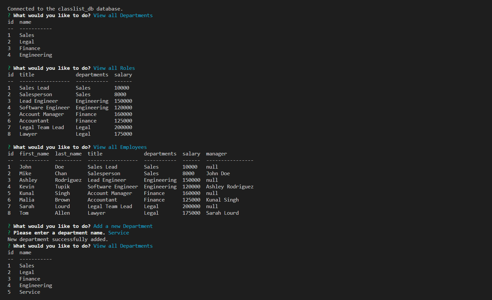
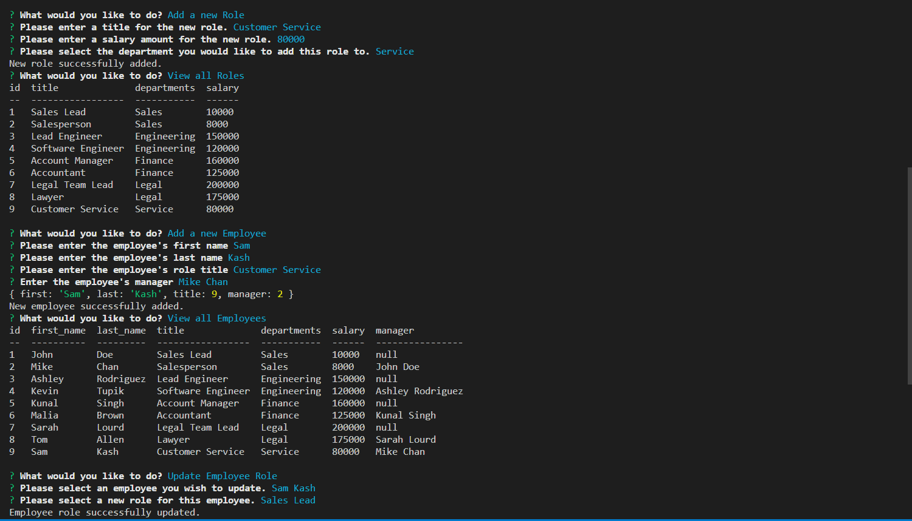

# Employee Tracker

    
## Table of Contents
* [Description](#description)
* [Built-With](#built-with)
* [Demo](#demo)
* [Installation](#installation)
* [Usage](#usage)
* [License](#license)
* [Contributing](#contributing)
* [Tests](#tests)
* [Questions](#questions)

## Description
    
This is an interactive command-line application built with Node.Js and Inquirer that accepts user input and allows a user to view, add and update information stored within a MYSQL database.

## Built-With

This app runs in the terminal and features dynamically updated code powered by Node.js.

  
  
  
  
  
  
  

## Demo

The following link includes a video demo of the application's functionality:

[Employee Tracker Video Demo](https://drive.google.com/file/d/1pNCzIv0Z4c35neRUv8YWJ2jQNNBfCvkU/view)

The following images demonstrate an example of what a user would view in the terminal when using this application.

## Installation

The user will first need to download the Node.js application onto their computer and then install the required packages by typing `npm i` into the terminal.

## Usage

In order to run the Employee Tracker, the user will need to type `node index.js` to launch the Inquirer prompt. From there, the user can view & add departments, roles and employees, as well as update an employee in the employee database.

## License
        
    MIT

## Contributing

Currently not accepting contributions to this project.

## Tests

N/A

## Questions

If there are additional questions, please reach out to me here: 

* GitHub: https://github.com/Carolinapalacios95
* Email: carolina.palacios1995@gmail.com